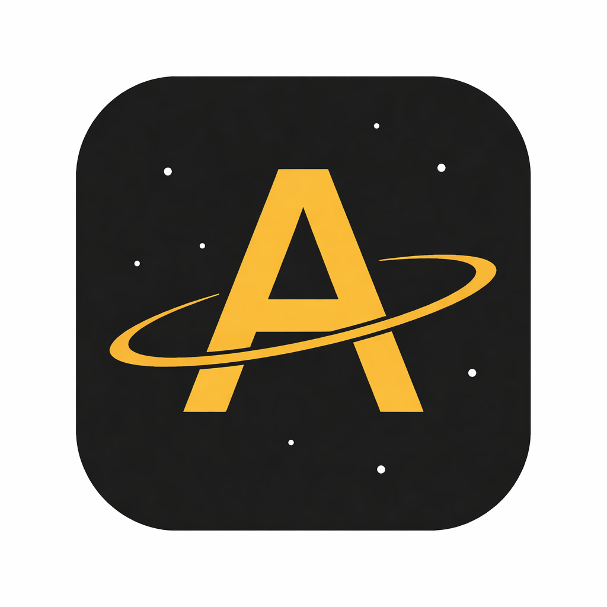

<div align="center">



# ASTRELLA

### *Focus like your mission depends on it.*

**A high-stakes, narrative-driven productivity timer — where focus equals fuel, and every session pushes your ship deeper into the galaxy.**

[](https://flutter.dev)
[](https://android.com)
[]()
[]()

</div>

---

## The Concept

Traditional productivity apps guilt you into focusing — a withered tree, a broken streak. **Astrella flips the script.**

You're a lone astronaut on a critical deep-space mission. Your focus is fuel. Every session fires your engines and pushes your ship further across the galaxy. Abandon the mission and your hull takes damage. Stay the course and the universe rewards you with discoveries.

The Pomodoro technique was built for a kitchen timer. Astrella was built for the void.

> *Inspired by the isolation, science, and survival themes of **Interstellar** and **Project Hail Mary**.*

---

## Screenshots

| ENGINE | NAV | SCIENCE | LOG |
|--------|-----|---------|-----|
|  |  |  |  |

---

## Demo

https://github.com/user-attachments/assets/15f4fa01-9c00-44bb-b01e-1c1c260e4de0

---

## Core Features

### 🚀 Engine Console
The heart of the app. Set your mission name and burn duration, then fire the engines. The circular thrust gauge depletes in real time as your session runs. No distractions — just you and the mission clock.

- Custom mission naming for every session
- Flexible burn duration (1–120 minutes)
- Real-time ambient sound toggle — play Interstellar's score during your burn
- Timer persists through app backgrounding and screen locks
- Live telemetry: today's burn time, active streak, LY earned today
- Dynamic hull integrity that degrades with aborted sessions and recovers with full burns

### 🗺️ Starmap
Your journey visualized. Every completed session earns Light Years, pushing your ship further along a trajectory across the galaxy. The animated star field drifts slowly — you're not standing still.

- Real LY counter based on session duration and quality
  - Full Burn: `minutes × 10 LY`
  - Partial Burn: `minutes × 5 LY`
  - Aborted: `0 LY`
- Ship position moves along trajectory based on progress toward 10,000 LY milestone
- Live ambient coordinate drift for atmosphere

### 🔬 Science Archive
Complete sessions to discover rare celestial phenomena. The archive shows all 16 anomalies — locked ones are visible but dimmed, creating the pull to unlock them. Each discovery adds a new card with a real NASA/ESA space photograph.

**Probability system tied to session duration and quality:**

| Duration | Full Burn | Partial Burn |
|----------|-----------|--------------|
| < 10 min | No roll | No roll |
| 10–24 min | 28% Common, 2% Rare | 15% Common |
| 25–49 min | 45% Common, 13% Rare, 2% Legendary | 30% Common, 5% Rare |
| 50–89 min | 40% Common, 30% Rare, 10% Legendary | 40% Common, 13% Rare, 2% Legendary |
| 90+ min | 30% Common, 40% Rare, 20% Legendary | 45% Common, 20% Rare, 5% Legendary |

**16 anomalies across 3 rarity tiers:**
- **Common (8):** Red Dwarf, Asteroid Field, Nebula Cloud, Rogue Planet, White Dwarf, Comet Trail, Solar Flare, Dark Matter Void
- **Rare (5):** Pulsar, Binary Star System, Magnetar, Wormhole, Quasar
- **Legendary (3):** Black Hole, Dyson Sphere, Alien Signal

### 📋 Flight Recorder
Every session logged. Every decision recorded. The flight recorder shows your complete mission history — serial numbers, mission names, timestamps, durations, and status badges. Aborted sessions are marked in red. No hiding from your own data.

---

## Honor System

Astrella doesn't block your apps or police your phone. That's not the point.

When a session ends, you report your own performance:

```
BURN COMPLETE — MISSION LOG UPDATED

Did you maintain focus?

[ FULL BURN ]   [ PARTIAL BURN ]   [ ABORTED ]
```

Nobody wants to be the astronaut who lies in the mission log.

---

## Tech Stack

| Layer | Technology |
|-------|-----------|
| Framework | Flutter 3.x |
| Language | Dart |
| State Management | StatefulWidget + setState |
| Persistence | SharedPreferences |
| Audio | just_audio |
| Fonts | Google Fonts — Space Mono |
| Assets | NASA/ESA public domain astronomy images |
| Platform | Android |

---

## Project Structure

```
lib/
├── main.dart                    # App entry point
├── engine_console_screen.dart   # Timer, session setup, discovery system
├── nav_screen.dart              # Starmap, LY tracking, animation
├── science_screen.dart          # Anomaly archive grid
├── log_screen.dart              # Flight recorder, session history
└── anomalies.dart               # Anomaly definitions and rarity data

assets/
├── anomalies/                   # 16 NASA/ESA space photographs
├── sounds/                      # Ambient burn audio
└── icon/                        # App icon
```

---

## Getting Started

```bash
# Clone the repository
git clone https://github.com/divyansh999-code/Astrella.git
cd Astrella

# Install dependencies
flutter pub get

# Run on connected Android device
flutter run

# Build release APK
flutter build apk --release
```

**Requirements:**
- Flutter 3.x
- Dart 3.x
- Android device or emulator (API 21+)

---

## Design Philosophy

> *"Traditional productivity apps rely on passive growth. Astrella relies on Active Survival and Infinite Discovery."*

Every design decision in Astrella was made to serve the narrative:

- **Dark mode only** — you're floating in the void, not working in a café
- **Monospaced typography** — every readout looks like a real instrument panel
- **Amber/gold palette** — cold warmth, like the Endurance interior in Interstellar
- **No blocking, no policing** — trust the astronaut to report honestly
- **Sound as atmosphere** — the burn hum isn't a notification, it's immersion

---

## Built By

**Divyansh Khandal** | AI Developer & Data Science Enthusiast

.

[](https://github.com/divyansh999-code)
[](https://linkedin.com/in/divyansh-khandal-5b8b8b32b)

---

<div align="center">

*The universe doesn't reward distraction.*

**🚀 INITIATE BURN**

</div>
